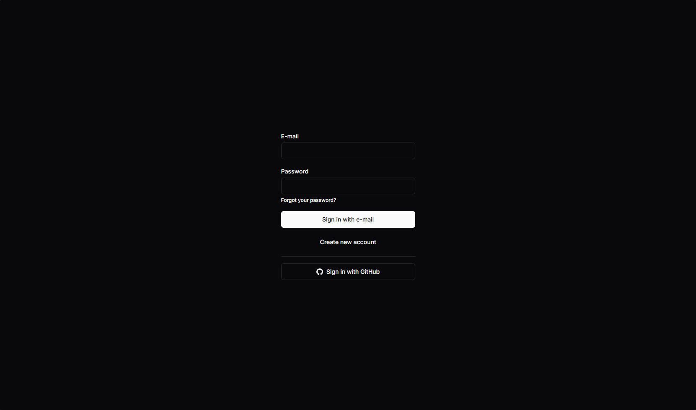
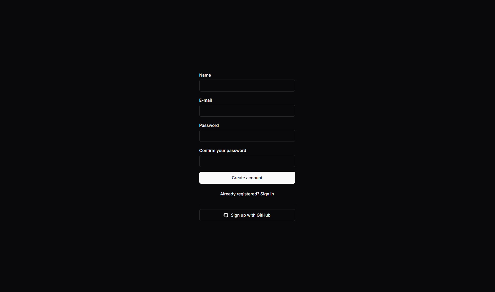
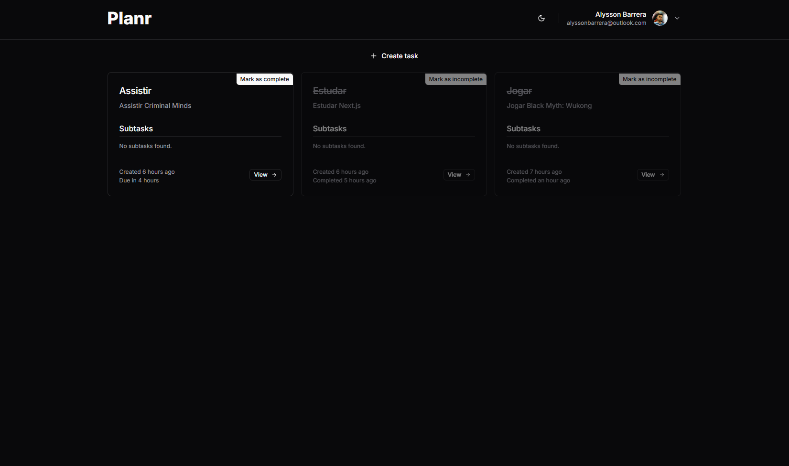
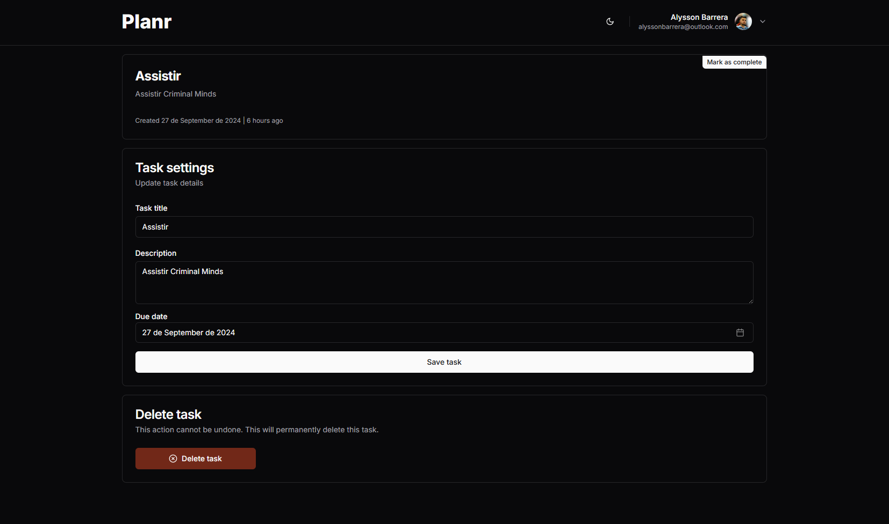

# Planr

Planr is a simple task manager to help you organize your tasks. This project was built with TypeScript, React, Next.js, TailwindCSS, Shadcn-ui, Zod and Supabase.

## Screenshots

    

        
        
        
        
    

## Techs

    
    
    
    
    
    
    

